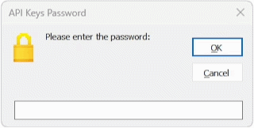

# CustomButton for Excel VBA UserForms

A lightweight Microsoft Excel Add-in designed to modernize the legacy **VBA UserForm** interface. `CustomButton` replicates the clean, minimalist aesthetic of Windows 10 & 11, replacing the dated look of standard Userform CommandButtons with a contemporary design.

  

## Key Features

* **UserForm Optimization:** Specifically engineered to work within the UserForm environment.
* **Modern Visual Language:** Implements the flat, professional button styling found in modern Windows environments.
* **Dynamic Visual Feedback:** Smooth hover-state transitions and fade effects that respond to user interaction within the UserForm.
* **Native VBA Implementation:** Built entirely within VBA to ensure portability and ease of use without external dependencies.

## Technical Overview

This project provides a robust solution for the visual limitations of standard **VBA UserForm** buttons. By leveraging internal event handling, it creates high-fidelity UI interactions that feel like native modern applications, all while remaining entirely within the Excel ecosystem.

## Installation & Usage

1. Download the repository files.
2. Import the required components into your VBA Project.
3. Run the `ShowUserFormCode()` to display the inital UserForm code to merge into your existing UserForm code.
4. Delete the CommandButtons that have been replaced by the new CustomButtons.
5. Show your UserForm to see the new buttons.

## License

This project is licensed under the **MIT License**. See the [LICENSE](../LICENSE) file for details.
